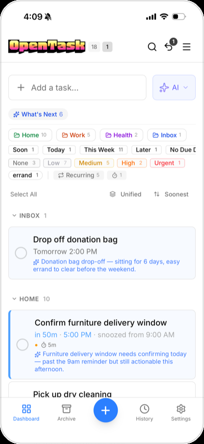
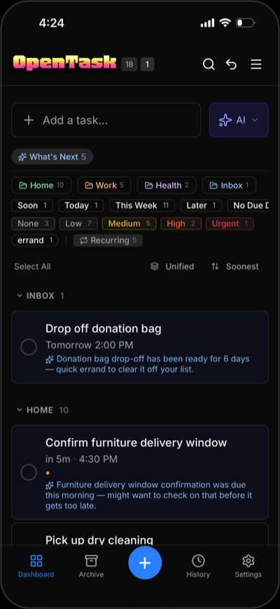

<p align="center">
  
</p>

<p align="center">
  
</p>

<p align="center">
  <strong>A self-hosted task manager with deep AI integration, a native iOS app, and a full REST API.</strong><br>
  Single container. SQLite. Your data, your server.
</p>

<p align="center">
  <a href="https://opentask.mcnitt.io"></a>
  <a href="https://github.com/trentmcnitt/opentask/pkgs/container/opentask"></a>
  <a href="LICENSE"></a>
</p>

<p align="center">
  <a href="https://opentask.mcnitt.io">Try the Demo</a> · <a href="https://opentask.mcnitt.io/docs/">Documentation</a> · <a href="https://opentask.mcnitt.io/docs/api/">API Reference</a> · <a href="https://opentask.mcnitt.io/docs/roadmap">Roadmap</a>
</p>

<p align="center">
  🌐 Web (PWA) · 📱 iOS (native) · ⌚ Apple Watch · 🔌 REST API · OpenAPI 3.1
</p>

<p align="center">
  
  &nbsp;&nbsp;&nbsp;&nbsp;&nbsp;
  
</p>

> [!NOTE]
> 🚧 **Early public release — looking for testers and contributors!** 🎉

OpenTask is a self-hosted task manager I built for personal use. I've been using it daily, and it's reached a point where I'm excited to open it up.

It runs as a single Docker container with SQLite — no Postgres, no Redis, no external services to manage. Your data lives in one file on your server.

## ✨ Features

### 📱 The app (web + iOS)

- **Mobile-first PWA** — Installable on iOS and Android. Designed for phones first, looks great on desktop too.
- **Snooze everything** — Bulk snooze all overdue tasks in one tap. Individual snooze with presets, fine-grained adjustments, or custom times.
- **Native iOS app** — Real push notifications with interactive snooze actions, including Apple Watch support. (Source included — not on the App Store.)
- **Full undo/redo** — Every action is logged and reversible.
- **Trash & archive** — Deleted tasks go to trash, completed tasks go to archive. Nothing is permanently lost until you say so.

### 🏠 Self-hosting

- **Single container** — SQLite with WAL mode. No external database, no message queue, no cache layer. Back up your data by copying one file.
- **Reverse proxy auth** — Works with Authelia, Authentik, and other auth proxies out of the box.
- **Data export** — JSON and CSV export of all your tasks, projects, and completions. Nothing is locked in.

### 🔧 Automation

- **Full REST API** — Every UI operation available over HTTP. Bearer token auth, [interactive API docs](https://opentask.mcnitt.io/docs/api/), and curl-friendly. Script it, automate it, pipe it into Apple Shortcuts.
- **Webhooks** — HTTP callbacks on task events with HMAC-SHA256 signing. Integrate with n8n, Home Assistant, or anything that accepts webhooks.
- **Optional AI** — Disabled by default. When enabled, you get natural language task creation, insights, "what's next" suggestions, and contextual commentary on new tasks. Works with Anthropic, OpenAI, Grok, DeepSeek, Ollama, and others. Turn it off and every trace of AI disappears from the UI.

## 🚀 Quick Start (Docker)

```bash
# Create a directory for OpenTask
mkdir opentask && cd opentask

# Download the compose file
curl -O https://raw.githubusercontent.com/trentmcnitt/opentask/main/docker-compose.yml

# Generate a secret key and start the app
cat > .env <<EOF
AUTH_SECRET=$(openssl rand -base64 32)
OPENTASK_INIT_USERNAME=admin
OPENTASK_INIT_PASSWORD=changeme
OPENTASK_INIT_TIMEZONE=America/New_York
EOF

docker compose up -d
```

Open [http://localhost:3000](http://localhost:3000) and log in with the username and password you set above. The initial user and database are created automatically on first start.

### Updating

```bash
docker compose pull
docker compose up -d
```

Your data is stored in `./data/` and persists across updates. Store this directory on a local filesystem — network mounts (NFS, CIFS) are not compatible with SQLite's file locking.

### Backup

SQLite makes backups simple — use the built-in `.backup` command for a safe, consistent copy:

```bash
# While running (recommended)
docker compose exec opentask sqlite3 /app/data/tasks.db '.backup /app/data/backup.db'
cp data/backup.db /path/to/your/backups/tasks-$(date +%F).db

# Or stop first, then copy directly
docker compose stop
cp data/tasks.db /path/to/your/backups/
docker compose start
```

> [!TIP]
> SQLite uses WAL (write-ahead logging), so `tasks.db-wal` and `tasks.db-shm` files may exist alongside the main database. A plain `cp tasks.db` while the app is running could produce an inconsistent backup. The `sqlite3 .backup` command handles this correctly.

### Additional Users

Create more users from the command line:

```bash
# Docker
docker compose exec opentask tsx scripts/create-user.ts <username> <password>

# Bare metal
npx tsx scripts/create-user.ts <username> <password> [email] [timezone]
```

### API Tokens

Create a Bearer token for API access and automation:

```bash
# Docker
docker compose exec opentask tsx scripts/create-token.ts <username> [token-name]

# Bare metal
npm run db:create-token -- <username> [token-name]
```

## 🛠️ Manual Installation

Requires Node.js 20+ and npm.

```bash
git clone https://github.com/trentmcnitt/opentask.git
cd opentask
npm install

# Configure
cp .env.example .env.local
# Edit .env.local — at minimum, set AUTH_SECRET (openssl rand -base64 32)

# Create your user
npx tsx scripts/create-user.ts admin changeme

# Build and start
npm run build
npm run start
```

For development: `npm run dev` starts a hot-reloading server on port 3000.

## ⚙️ Configuration

See `.env.example` for all options. The essentials:

| Variable              | Required | Description                                         |
| --------------------- | -------- | --------------------------------------------------- |
| `AUTH_SECRET`         | Yes      | Secret key for sessions (`openssl rand -base64 32`) |
| `AUTH_URL`            | No       | Public URL when behind a reverse proxy              |
| `OPENTASK_DB_PATH`    | No       | SQLite database path (default: `./data/tasks.db`)   |
| `OPENTASK_AI_ENABLED` | No       | Enable AI features (default: `false`)               |

Login is **username-based**, not email-based.

### Reverse Proxy

OpenTask runs on port 3000 by default. Set `AUTH_URL` to your public URL when using a reverse proxy.

<details>
<summary>Caddy</summary>

```
tasks.example.com {
    reverse_proxy localhost:3000
}
```

</details>

<details>
<summary>Nginx</summary>

```nginx
server {
    server_name tasks.example.com;

    location / {
        proxy_pass http://localhost:3000;
        proxy_set_header Host $host;
        proxy_set_header X-Real-IP $remote_addr;
        proxy_set_header X-Forwarded-For $proxy_add_x_forwarded_for;
        proxy_set_header X-Forwarded-Proto $scheme;

        # Required for Server-Sent Events (SSE)
        proxy_buffering off;
        proxy_cache off;
    }
}
```

</details>

> [!NOTE]
> OpenTask uses Server-Sent Events for real-time updates. Caddy handles this automatically. Nginx needs `proxy_buffering off`.

### Reverse Proxy Header Auth

If you run an auth proxy like [Authelia](https://www.authelia.com/), [Authentik](https://goauthentik.io/), or Caddy's `forward_auth`, OpenTask can trust the authenticated username from a request header — no separate login required.

```yaml
# docker-compose.yml
environment:
  OPENTASK_PROXY_AUTH_HEADER: Remote-User
```

The header value must match an existing OpenTask username (case-insensitive). Users are not auto-created.

> [!WARNING]
> Your reverse proxy **must** strip this header from external requests. If external clients can set this header directly, they can authenticate as any user.

### Push Notifications

- **Web Push** — Generate VAPID keys with `npx web-push generate-vapid-keys` and set them in your environment. Works on all platforms including iOS Safari.
- **iOS Native (APNs)** — Requires the iOS companion app and an Apple Developer Program membership. See `.env.example` for configuration.

### AI Features

AI is entirely optional — when disabled (the default), all AI UI is hidden and no AI code runs.

When enabled, you get:

- **Task enrichment** — Natural language → structured task with title, due date, priority, labels, and project
- **Quick Take** — One-liner commentary when you add a task
- **What's Next** — Suggestions surfacing overlooked or forgotten tasks
- **Insights** — Scoring and signals to help prioritize

Tested with Claude (Anthropic API), GPT-4.1-mini, Grok, and DeepSeek. Any OpenAI-compatible provider works too — see `.env.example` for quick-start examples.

## 🔗 API

Three auth methods, checked in order: **Bearer token** → **Proxy header** → **Session cookie**

Key endpoints:

| Endpoint                         | Method   | Description                      |
| -------------------------------- | -------- | -------------------------------- |
| `/api/tasks`                     | GET      | List tasks with filters          |
| `/api/tasks`                     | POST     | Create a task                    |
| `/api/tasks/:id`                 | PATCH    | Update task fields               |
| `/api/tasks/:id`                 | DELETE   | Soft delete to trash             |
| `/api/tasks/:id/done`            | POST     | Mark done (advances recurring)   |
| `/api/tasks/:id/snooze`          | POST     | Snooze to future time            |
| `/api/tasks/bulk/snooze-overdue` | POST     | One-tap snooze all overdue tasks |
| `/api/tasks/bulk/done`           | POST     | Bulk mark done                   |
| `/api/tasks/bulk/snooze`         | POST     | Bulk snooze by task IDs          |
| `/api/undo`                      | POST     | Undo last action                 |
| `/api/redo`                      | POST     | Redo last undone action          |
| `/api/projects`                  | GET/POST | List/create projects             |
| `/api/export`                    | GET      | Export data (JSON or CSV)        |
| `/api/webhooks`                  | GET/POST | List/create webhooks             |
| `/api/openapi`                   | GET      | OpenAPI 3.1 spec (no auth)       |

Full API reference with curl examples, webhook setup, and Apple Shortcuts integration: **[Documentation →](https://opentask.mcnitt.io/docs/automation/getting-started)**

## 🧱 Tech Stack

| Layer    | Technology                                           |
| -------- | ---------------------------------------------------- |
| Runtime  | Next.js 16 (App Router) + React 19 + TypeScript      |
| Database | SQLite with WAL mode (better-sqlite3)                |
| Auth     | NextAuth/Auth.js (credentials, JWT sessions)         |
| Styling  | Tailwind CSS 4 + Shadcn UI                           |
| Testing  | Vitest (behavioral + integration) + Playwright (E2E) |

## 📁 Project Structure

```
src/
├── app/              # Next.js pages and API routes
├── components/       # React components
├── core/             # Business logic (auth, db, tasks, recurrence, undo, ai)
├── hooks/            # Custom React hooks
├── lib/              # Utilities
└── types/            # TypeScript types
ios/                  # Native iOS companion app (SwiftUI + WKWebView)
tests/                # Behavioral, integration, E2E, and AI quality tests
docs/                 # Product spec, design rationale, API guide, roadmap
```

## 🤝 Contributing

Contributions are welcome! See [CONTRIBUTING.md](CONTRIBUTING.md) for the full guide.

```bash
git clone https://github.com/trentmcnitt/opentask.git
cd opentask
npm install
cp .env.example .env.local
echo 'AUTH_SECRET=dev-secret-change-me' >> .env.local
npm run db:seed-dev
npm run dev
# Open http://localhost:3000 — login: dev / dev
```

[CLAUDE.md](CLAUDE.md) has detailed development conventions for AI-assisted development.

## 📄 License

[AGPL-3.0](LICENSE)
